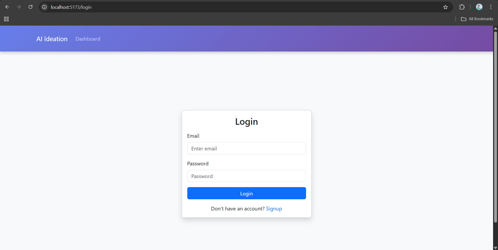
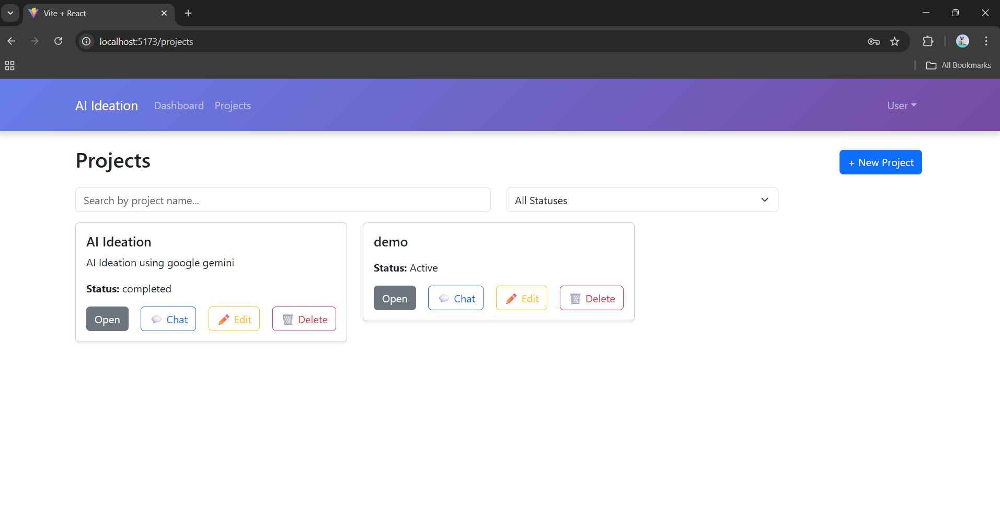
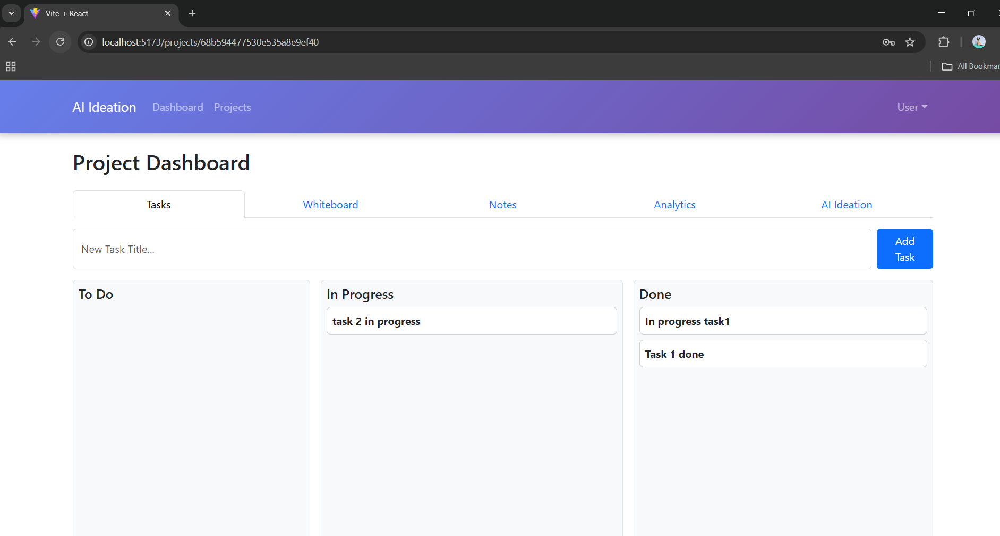
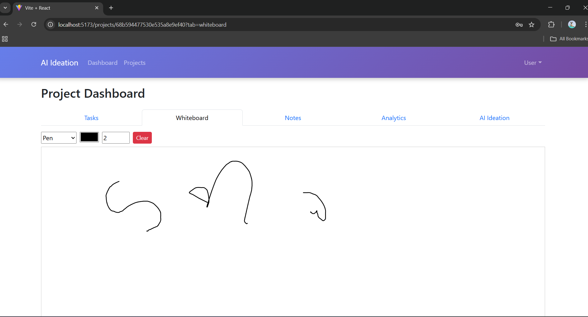
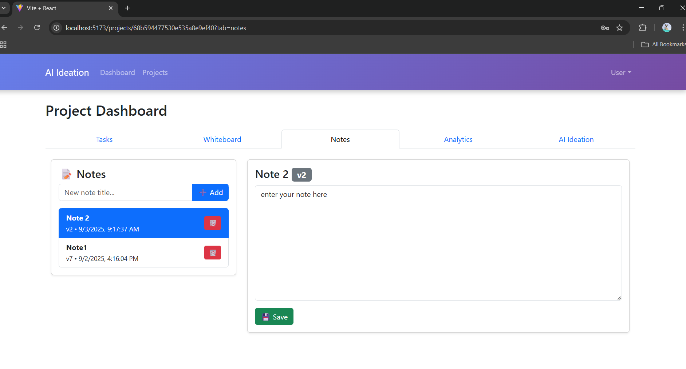
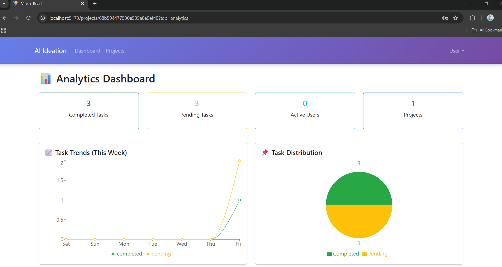
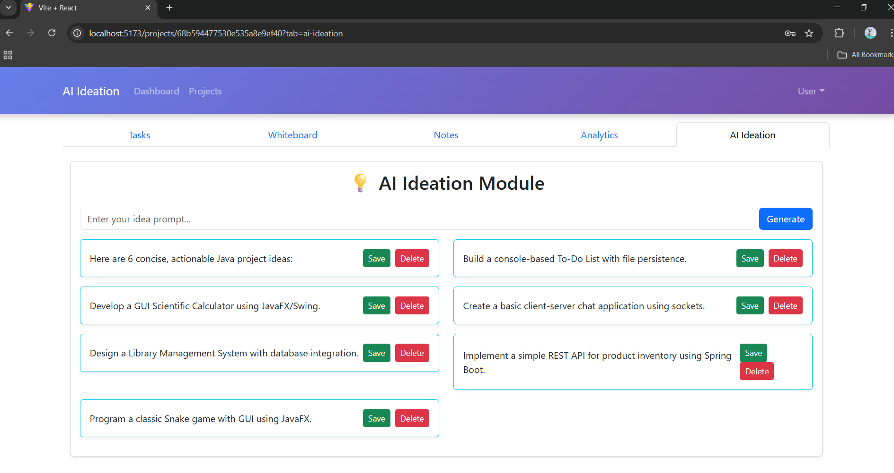

# Collaborative AI-Powered Ideation & Project Management Platform

A **MERN Stack-based collaborative platform** that empowers teams to **brainstorm ideas, plan projects, and manage tasks** with **real-time interaction** and **AI-powered assistance** for smarter and more productive teamwork.

This platform acts as a **virtual workspace** where innovation meets organization — combining intelligent suggestions, live collaboration, and structured task management to help teams turn ideas into impactful outcomes.

---

## 🚀 Project Overview

###  **Problem Statement**
Develop an advanced platform for teams to collaboratively brainstorm ideas, plan projects, and manage tasks with **real-time interaction** and **AI assistance** to enhance productivity and creativity.

###  **Use Case**
A **comprehensive team collaboration tool** that facilitates:
- **Idea generation and brainstorming** using AI  
- **Seamless communication and project management** in real-time  
- **Dynamic updates and intelligent task recommendations** for fast-paced team environments  

---

##  Key Features & Modules

### 🤖 1. AI-Powered Idea Generation & Brainstorming
- Integrated AI assistant for idea suggestions, creative prompts, and project naming
- Smart ideation tools for teams to refine, expand, or merge concepts
- Context-aware recommendations for next steps and resources

### 🧠 2. Real-time Collaborative Whiteboard 
- Real-time brainstorming using **Socket.IO**
- Interactive whiteboard and mind mapping for visual idea organization
- Live cursor tracking and color-coded team member interactions

### 🗂️ 3. Dynamic Kanban-style Project Boards
- Drag-and-drop task management interface
- Columns for task stages (To-Do, In Progress, Done)
- Customizable boards for multiple projects and teams

### 🔐 4. Role-Based Access Control (RBAC)
- Role management: **Admin**, **Project Manager**, **Member**, **Viewer**
- Controlled permissions for editing, assigning, and managing boards
- Secure authentication and authorization using **JWT**

### 💬 5. Real-time Chat & Commenting System
- In-app group chat and task-specific comment threads
- WebSocket-based real-time messaging
- Mentions, reactions, and threaded discussions

### 📄 6. Version Control for Collaborative Documents
- Real-time note editing with version history
- Document comparison and rollback features
- Integrated autosave and collaborative editing support

### 📊 7. Analytics Dashboard with AI-driven Insights
- AI-powered productivity insights and task completion trends
- Visual analytics for project progress and performance
- Team contribution tracking and workload visualization

---

## 🛠️ Tech Stack

| Layer | Technology |
|-------|-------------|
| **Frontend** | React.js, Redux Toolkit, Bootstrap |
| **Backend** | Node.js, Express.js, Socket.IO |
| **Database** | MongoDB with Mongoose |
| **AI Integration** | OpenAI API-Google Gemini API |
| **Authentication** | JWT (JSON Web Token), bcrypt.js |
| **Real-time Communication** | Socket.IO |
| **Version Control & Deployment** | Git, GitHub |
| **Development Tools** | VS Code, Postman, MongoDB Compass |

---

---

## ⚙️ Installation & Setup

### 1️⃣ Clone the repository
```bash
git clone https://github.com/sanapatel762080/Collaborative-AI-Powered-Ideation.git


2️⃣ Install dependencies

Backend:
cd backend
npm install

Frontend:
cd frontend
npm install

3️⃣ Configure environment variables

Create a .env file inside the /server folder:
PORT=5000
MONGO_URI=your_mongodb_connection_string
JWT_SECRET=your_secret_key
OPENAI_API_KEY=your_Google_Gemini_API_Key

4️⃣ Run the app

Start backend:
cd backend
npm run dev

Start frontend:
cd frontend
npm run dev

Now open 👉 http://localhost:3000

📸 Screenshots 









